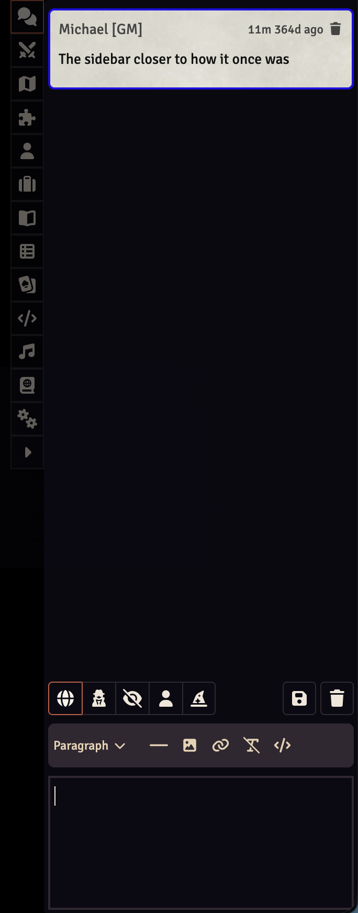

# Compact Chat

* User config setting to make the siderail buttons more compact
* User config settings to hide certain unused tabs if desired (e.g. no need to show cards if your system doesn't use them)

## Examples

